# CLICK READ & THINK

เว็บไซต์ตัวอย่างร้านขายหนังสือออนไลน์

## File Structure

my-business-web
 
│
 
├── index.html
 
├── about.html
 
├── services.html
 
├── contact.html
 
├── css/
 
│   ├── styles.css
 
│
 
├── images/
 
│   ├── logo.png
 
│   ├── team-member-1.jpg
 
│   ├── team-member-2.jpg
 
│   ├── team-member-3.jpg
 
│   ├── service-1.png
 
│   ├── service-2.png
 
│   └── service-3.png
 
│
 
└── README.md
 
│
 
└── .gitignore

## Pages
๏ Home
 
- Assignment#1
 
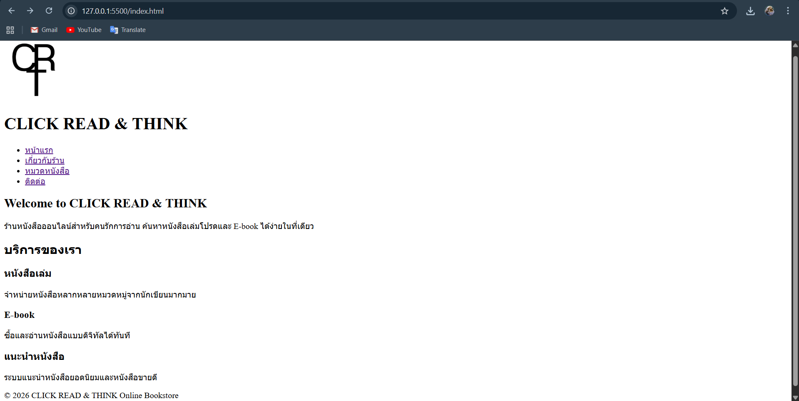
 
- Assignment#2
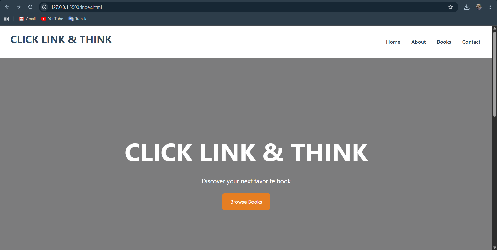
 
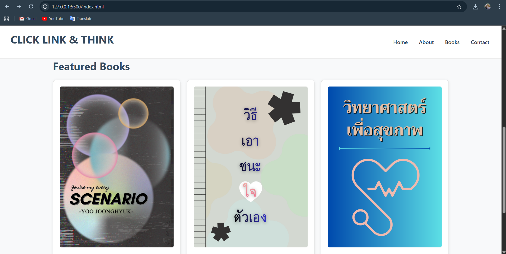
 
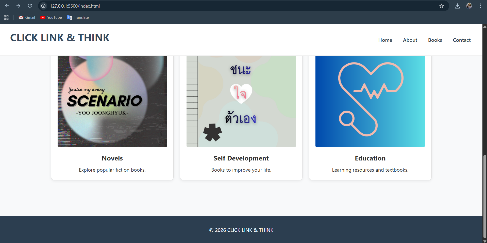
 
Link: http://127.0.0.1:5500/index.html
 

 
๏ About
 
- Assignment#1
 
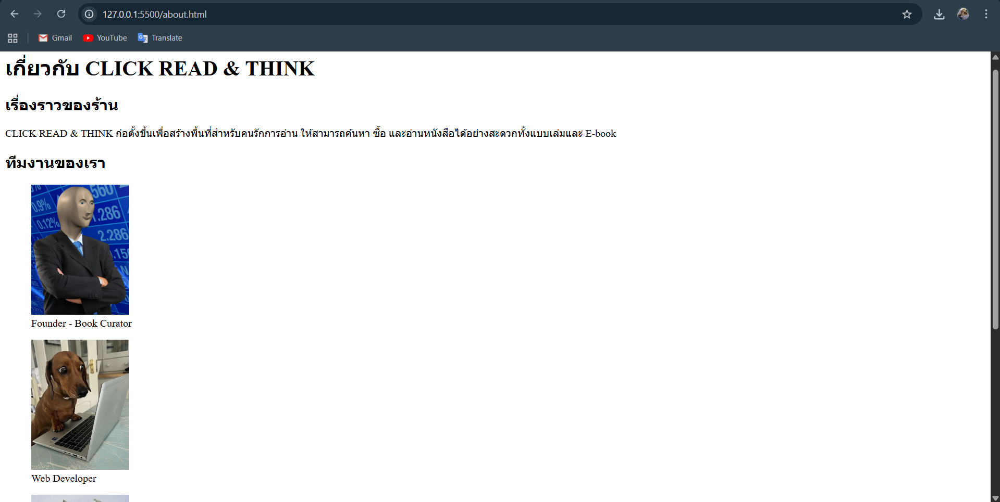
 
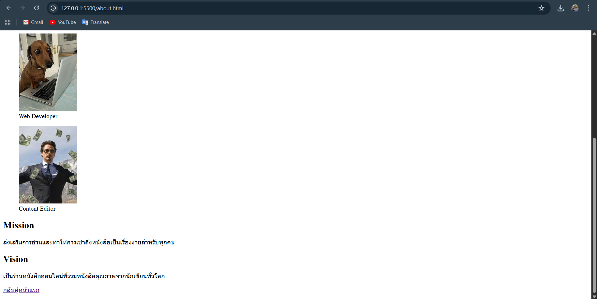
 
- Assignment#2
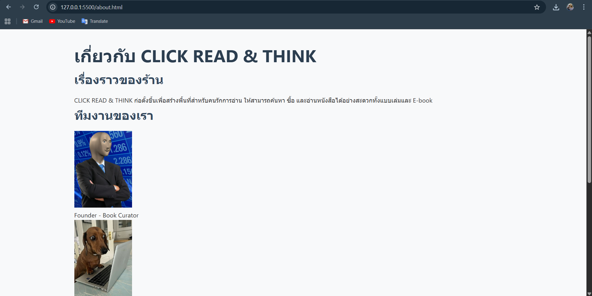
 
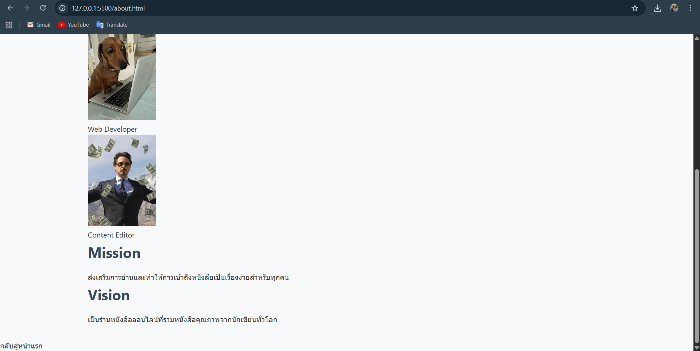
 
Link: http://127.0.0.1:5500/about.html
 

 
๏ Services (Book Categories)
 
- Assignment#1
 
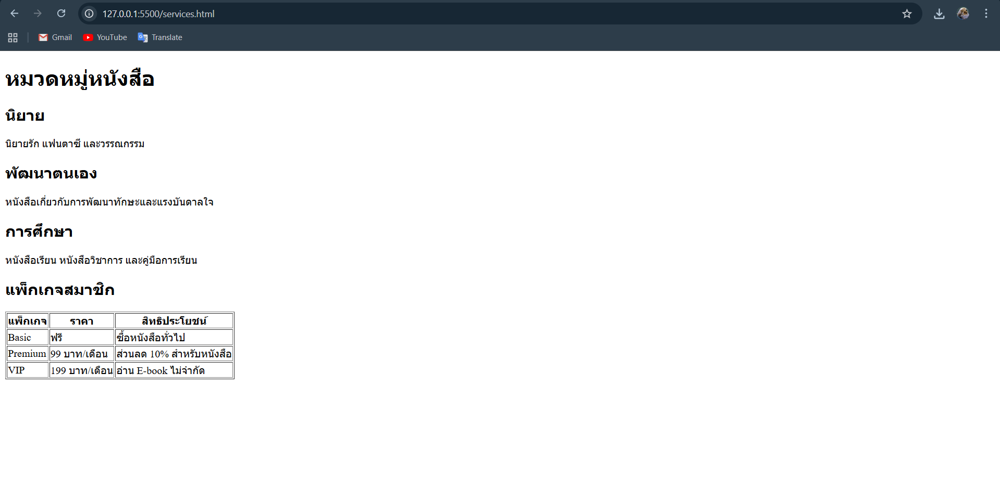
 
- Assignment#2
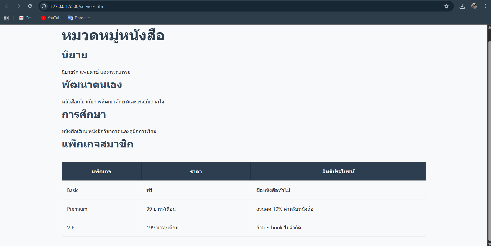
 
Link: http://127.0.0.1:5500/services.html
 

 
๏ Contact
 
- Assignment#1
 
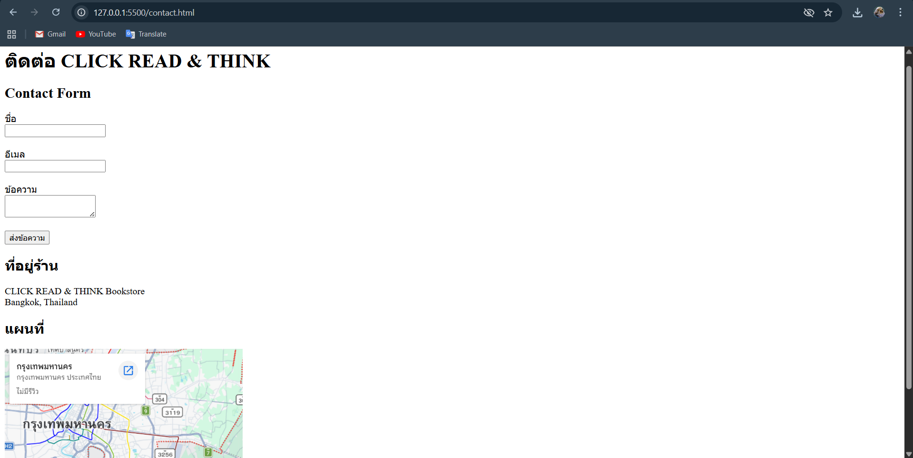
 
- Assignment#2
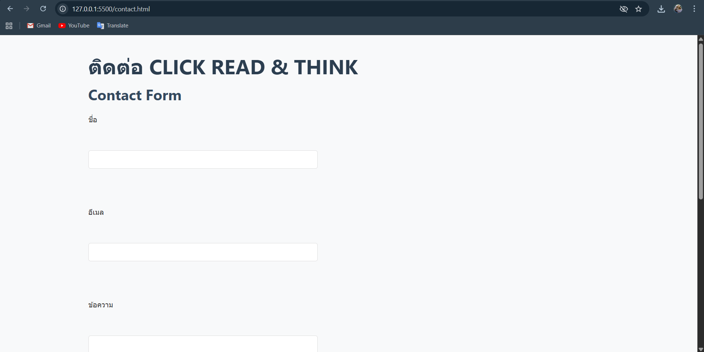
 
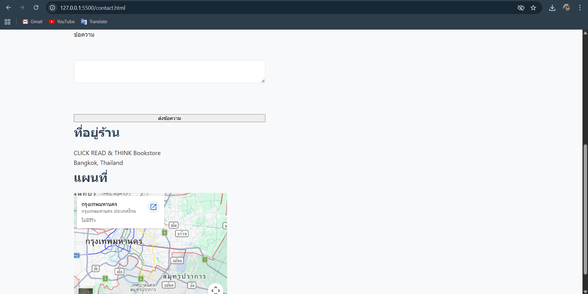
 
Link: http://127.0.0.1:5500/contact.html
 